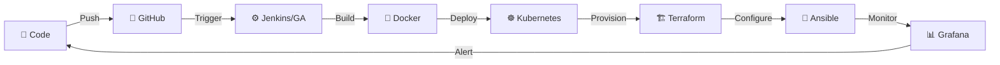

<!--
  Professional DevOps GitHub Profile README
  Profile: DevPawanX
  Username: DevPawanX
-->

<div align="center">


<a href="https://git.io/typing-svg">
  
</a>

<br/>

<!-- Animated Snake Divider -->


<br/>

<a href="https://github.com/DevPawanX">
  
</a>
<a href="https://github.com/SakshuOfficialOS">
  
</a>
<a href="mailto:proxypawang@gmail.com">
  
</a>
<a href="https://discord.com/users/dev.pawanx_">
  
</a>

<br/><br/>


</div>

---

<!-- Animated Gradient Line -->


##  About Me

<div align="center">

<!-- Animated Terminal Card -->
```
╔══════════════════════════════════════════════════════════════════╗
║                                                                  ║
║   $ whoami                                                       ║
║   > DevPawanX — DevOps Engineer                                  ║
║                                                                  ║
║   $ cat /etc/profile                                             ║
║   Name       : DevPawanX                                         ║
║   Username   : DevPawanX                                         ║
║   Role       : DevOps Engineer                                   ║
║   Age        : 26                                                ║
║   Languages  : English, Hinglish                                 ║
║   Focus      : Cloud Infrastructure · CI/CD · Automation · IaC   ║
║   Email      : proxypawang@gmail.com                             ║
║   Discord    : dev.pawanx_                                       ║
║                                                                  ║
╚══════════════════════════════════════════════════════════════════╝
```

</div>

<br/>

<div align="center">


</div>

<br/>

<div align="center">

Professional DevOps Engineer focused on building scalable infrastructure, automating delivery pipelines, and improving system reliability across cloud-native environments.  
I have **intermediate knowledge of Python, Node.js, and HTML**, along with **advanced practical experience in DevOps tooling, CI/CD workflows, container orchestration, infrastructure automation, monitoring, and cloud operations**.

<br/>

> *"Automate everything. Document everything. Break nothing in production."*

</div>

<br/>

<div align="center">


</div>


---

##  Tech Stack

<div align="center">

### ⚙️ DevOps & Infrastructure
<p>
  
</p>

### 💻 Programming
<p>
  
</p>

### 🛠️ Tools & Platforms
<p>
  
</p>

</div>

---

##  Advanced DevOps Tools Used in Real Workflows

<div align="center">

<p>
  
</p>

<br/>

<p>
  
  
  
  
  
  
</p>

</div>

<div align="center">

| 🏷️ Area | 🔧 Tools |
|:------:|:-------:|
| CI/CD Automation | Jenkins, GitHub Actions, ArgoCD |
| Containers & Orchestration | Docker, Kubernetes, Helm |
| Infrastructure as Code | Terraform, Ansible |
| Cloud Platforms | AWS, Azure, Google Cloud |
| Monitoring & Logs | Prometheus, Grafana, ELK Stack |
| AI in DevOps | TensorFlow |
| Security & Secrets | HashiCorp Vault |
| Reverse Proxy | Nginx |

</div>

---

##  DevOps Skill Proficiency

<div align="center">

```
CI/CD Automation        ████████████████████████████████████████████████  95%
Container Orchestration ██████████████████████████████████████████████    92%
Infrastructure as Code  ████████████████████████████████████████████      88%
Cloud Platforms (AWS)   ██████████████████████████████████████████        85%
Monitoring & Logging    ████████████████████████████████████████          82%
Python Scripting        ██████████████████████████████████                68%
Node.js Development     ████████████████████████████                      58%
AI/ML in DevOps         ██████████████████████████                        52%
```

</div>

---

##  DevOps Certification Roadmap

<div align="center">

<table>
  <tr>
    <td align="center" width="33%">
      <br/>
      <br/>
      <sub>Linux · Git · Bash · Networking</sub><br/>
      
    </td>
    <td align="center" width="33%">
      <br/>
      <br/>
      <sub>Docker · Compose · Security</sub><br/>
      
    </td>
    <td align="center" width="33%">
      <br/>
      <br/>
      <sub>Terraform · Ansible · Helm</sub><br/>
      
    </td>
  </tr>
  <tr>
    <td align="center" width="33%">
      <br/>
      <br/>
      <sub>AWS · Azure · GCP</sub><br/>
      
    </td>
    <td align="center" width="33%">
      <br/>
      <br/>
      <sub>Prometheus · Grafana · ELK</sub><br/>
      
    </td>
    <td align="center" width="33%">
      <br/>
      <br/>
      <sub>TensorFlow · AI-assisted CI/CD · MLOps</sub><br/>
      
    </td>
  </tr>
</table>

</div>

<br/>

<div align="center">


</div>


---

##  GitHub Stats & Activity

<div align="center">


<br/>


<br/>

<!-- Animated Contribution Graph -->


<br/>

<!-- Trophy Section -->


</div>

---

##  DevOps Focus Areas

<div align="center">


</div>

---

##  Featured Projects

<div align="center">

<table>
  <tr>
    <td width="50%">
      <h3 align="center">🚀 CI/CD Pipeline Automation</h3>
      <div align="center">
        
      </div>
      <p align="center">
        Automated build, test, and deployment workflows for faster and more reliable software delivery.
      </p>
      <p align="center">
        
        
        
      </p>
    </td>
    <td width="50%">
      <h3 align="center">☸️ Kubernetes Deployment System</h3>
      <div align="center">
        
      </div>
      <p align="center">
        Production-ready container deployment workflow with orchestration, scaling, and rollout management.
      </p>
      <p align="center">
        
        
        
      </p>
    </td>
  </tr>
  <tr>
    <td width="50%">
      <h3 align="center">🏗️ Infrastructure as Code Templates</h3>
      <div align="center">
        
      </div>
      <p align="center">
        Reusable and modular infrastructure templates for provisioning secure, scalable environments.
      </p>
      <p align="center">
        
        
        
      </p>
    </td>
    <td width="50%">
      <h3 align="center">📊 Monitoring Stack Setup</h3>
      <div align="center">
        
      </div>
      <p align="center">
        End-to-end observability stack for metrics, dashboards, alerting, and centralized log analysis.
      </p>
      <p align="center">
        
        
        
      </p>
    </td>
  </tr>
</table>

</div>

---

##  Current DevOps Workflow

<div align="center">



</div>

<br/>

<div align="center">


<br/>


</div>

---

##  Weekly DevOps Activity

<div align="center">

<!--START_SECTION:waka-->
```text
Terraform        ████████████████░░░░░░░  35.2%
YAML/Helm        ███████████████░░░░░░░░  30.8%
Docker           ████████████░░░░░░░░░░░  15.4%
Bash             ██████░░░░░░░░░░░░░░░░░   8.6%
Python           █████░░░░░░░░░░░░░░░░░░   6.2%
Markdown         ██░░░░░░░░░░░░░░░░░░░░░   3.8%
```
<!--END_SECTION:waka-->

</div>

---

##  Connect With Me

<div align="center">

<a href="https://github.com/DevPawanX">
  
</a>
<a href="https://discord.com/users/dev.pawanx_">
  
</a>
<a href="mailto:proxypawang@gmail.com">
  
</a>

<br/><br/>

 <em><b>I love connecting with people!</b> If you want to collaborate on DevOps, cloud, or infrastructure projects — <b>feel free to reach out!</b></em>

</div>

---

##  Extra Widgets

<div align="center">


<br/><br/>

<!-- Spotify / Quote Widget -->


</div>

---

##  Random Dev Joke

<div align="center">


</div>

---


## Credits

<div align="center">

**Designed and maintained by DevPawanX**  
**All configurations, infrastructure designs, and automation workflows created and documented by DevPawanX.**

**Support credit:** [Sakshu1347](https://github.com/Sakshu1347)  
**Template/design inspiration credit:** [SakshuOfficialOS](https://github.com/SakshuOfficialOS)

<br/>


</div>

<br/>

<div align="center">


</div>
