```mermaid
%%{init: {'theme': 'dark', 'themeVariables': { 'primaryColor': '#0d1117', 'primaryTextColor': '#22d3ee', 'primaryBorderColor': '#22d3ee', 'lineColor': '#3b82f6', 'secondaryColor': '#111827', 'tertiaryColor': '#0f172a', 'fontFamily': 'JetBrains Mono'}}}%%
graph LR
    A["📝 Code<br/>GitHub"] -->|Push| B["🔄 Trigger<br/>Webhook"]
    B -->|Build| C["⚙️ Jenkins/GA<br/>CI Pipeline"]
    C -->|Scan| D["🔍 SonarQube<br/>Quality Gate"]
    D -->|Package| E["🐳 Docker<br/>Container"]
    E -->|Push| F["📦 Registry<br/>ECR/GHCR"]
    F -->|Deploy| G["☸️ Kubernetes<br/>Cluster"]
    G -->|Manage| H["🎯 ArgoCD<br/>GitOps"]
    H -->|Monitor| I["📊 Grafana<br/>Dashboard"]
    I -->|Alert| J["🔔 Prometheus<br/>Alerting"]
    J -.->|Feedback| A
    
    style A fill:#0d1117,stroke:#22d3ee,color:#fff
    style B fill:#0d1117,stroke:#3b82f6,color:#fff
    style C fill:#0d1117,stroke:#D24939,color:#fff
    style D fill:#0d1117,stroke:#4E9BCD,color:#fff
    style E fill:#0d1117,stroke:#2496ED,color:#fff
    style F fill:#0d1117,stroke:#7B42BC,color:#fff
    style G fill:#0d1117,stroke:#326CE5,color:#fff
    style H fill:#0d1117,stroke:#EF7B4D,color:#fff
    style I fill:#0d1117,stroke:#F46800,color:#fff
    style J fill:#0d1117,stroke:#E6522C,color:#fff
```

<!--
  Professional DevOps GitHub Profile README
  Profile: DevPawanX
  Username: DevPawanX
  Version: 4.0 — Ultimate Professional Edition
-->

<div align="center">

<!-- Animated Header Banner -->


<!-- Animated Typing -->
<a href="https://git.io/typing-svg">
  
</a>

<br/>

<!-- Social Links -->
<a href="https://github.com/DevPawanX">
  
</a>
<a href="https://github.com/SakshuOfficialOS">
  
</a>
<a href="https://discord.com/users/dev.pawanx_">
  
</a>
<a href="mailto:proxypawang@gmail.com">
  
</a>

<br/><br/>

<!-- Profile Badges -->


<br/><br/>

<!-- Snake Contribution Animation -->
<picture>
  <source media="(prefers-color-scheme: dark)" srcset="https://raw.githubusercontent.com/platane/snk/output/github-contribution-grid-snake-dark.svg" />
  <source media="(prefers-color-scheme: light)" srcset="https://raw.githubusercontent.com/platane/snk/output/github-contribution-grid-snake.svg" />
  
</picture>

</div>

<!-- Animated Divider -->


<br/>

##  &nbsp; About Me

<div align="center">

<!-- Terminal Style Card -->
```
┌──────────────────────────────────────────────────────────────────────────┐
│                                                                          │
│   ██████╗ ███████╗██╗   ██╗██████╗  █████╗ ██╗    ██╗ █████╗ ███╗  ██╗  │
│   ██╔══██╗██╔════╝██║   ██║██╔══██╗██╔══██╗██║    ██║██╔══██╗████╗ ██║  │
│   ██║  ██║█████╗  ██║   ██║██████╔╝███████║██║ █╗ ██║███████║██╔██╗██║  │
│   ██║  ██║██╔══╝  ╚██╗ ██╔╝██╔═══╝ ██╔══██║██║███╗██║██╔══██║██║╚████║  │
│   ██████╔╝███████╗ ╚████╔╝ ██║     ██║  ██║╚███╔███╔╝██║  ██║██║ ╚███║  │
│   ╚═════╝ ╚══════╝  ╚═══╝  ╚═╝     ╚═╝  ╚═╝ ╚══╝╚══╝ ╚═╝  ╚═╝╚═╝ ╚══╝  │
│                                                                          │
│   $ whoami                                                               │
│   ──────────────────────────────────────────────────────────────          │
│                                                                          │
│   Name          :  DevPawanX                                             │
│   Organization  :  SakshuOfficialOS                                      │
│   Role          :  DevOps Engineer                                       │
│   Age           :  26                                                    │
│   Languages     :  English, Hinglish                                     │
│   Focus         :  Cloud Infrastructure · CI/CD · Automation · IaC       │
│   Email         :  proxypawang@gmail.com                                 │
│   Discord       :  dev.pawanx_                                           │
│                                                                          │
│   $ cat /etc/philosophy                                                  │
│   > "Automate everything. Document everything.                           │
│      Break nothing in production."                                       │
│                                                                          │
│   $ systemctl status devops-engineer                                     │
│   ● devops-engineer.service - Active & Running                           │
│     Loaded: loaded (/etc/systemd/system/devops.service; enabled)         │
│     Active: active (running) since day one                               │
│                                                                          │
└──────────────────────────────────────────────────────────────────────────┘
```

</div>

<br/>

<div align="center">

Professional DevOps Engineer focused on building scalable infrastructure, automating delivery pipelines, and improving system reliability across cloud-native environments.  
Intermediate proficiency in **Python, Node.js, and HTML** — combined with **advanced hands-on experience** in DevOps tooling, CI/CD workflows, container orchestration, infrastructure automation, monitoring, and cloud operations.

<br/>


</div>

<br/>


<br/>

##  &nbsp; Tech Stack

<div align="center">

####  &nbsp; DevOps & Infrastructure
<p>
  
</p>

####  &nbsp; Programming & Scripting
<p>
  
</p>

####  &nbsp; Tools & Platforms
<p>
  
</p>

</div>

<br/>


<br/>

##  &nbsp; Advanced DevOps Toolchain

<div align="center">

<p>
  
</p>
<p>
  
</p>

<br/>

<p>
  
  
  
  
  
  
  
  
</p>

</div>

<br/>

<div align="center">

|  &nbsp; Area |  &nbsp; Tools |
|:------|:-------|
| CI/CD Automation | Jenkins · GitHub Actions · ArgoCD |
| Containers & Orchestration | Docker · Kubernetes · Helm · Istio |
| Infrastructure as Code | Terraform · Ansible · CloudFormation · Pulumi |
| Cloud Platforms | AWS · Azure · Google Cloud |
| Monitoring & Observability | Prometheus · Grafana · ELK Stack · Jaeger |
| Security & Secrets | HashiCorp Vault · SonarQube · Trivy |
| Service Mesh & Networking | Istio · Consul · Nginx · HAProxy |
| AI in DevOps | TensorFlow · ML-assisted CI/CD · AIOps |

</div>

<br/>


<br/>

##  &nbsp; DevOps Skill Proficiency

<div align="center">

|  Skill | Proficiency | Level |
|:---|:---|:---:|
|  &nbsp; CI/CD Automation |  | **95%** |
|  &nbsp; Container Orchestration |  | **92%** |
|  &nbsp; Infrastructure as Code |  | **88%** |
|  &nbsp; Cloud Platforms (AWS) |  | **85%** |
|  &nbsp; Monitoring & Logging |  | **82%** |
|  &nbsp; Containerization |  | **90%** |
|  &nbsp; Python Scripting |  | **68%** |
|  &nbsp; Node.js Development |  | **58%** |
|  &nbsp; AI/ML in DevOps |  | **52%** |

</div>

<br/>


<br/>

##  &nbsp; DevOps Certification Roadmap

<div align="center">

<table>
  <tr>
    <td align="center" width="33%">
      <br/>
      <br/><br/>
      <br/><br/>
      <sub><b>Linux · Git · Bash · Networking · SSH</b></sub><br/><br/>
      
      <br/><br/>
    </td>
    <td align="center" width="33%">
      <br/>
      <br/><br/>
      <br/><br/>
      <sub><b>Docker · Compose · Registry · Security</b></sub><br/><br/>
      
      <br/><br/>
    </td>
    <td align="center" width="33%">
      <br/>
      <br/><br/>
      <br/><br/>
      <sub><b>Terraform · Ansible · Helm · Pulumi</b></sub><br/><br/>
      
      <br/><br/>
    </td>
  </tr>
  <tr>
    <td align="center" width="33%">
      <br/>
      <br/><br/>
      <br/><br/>
      <sub><b>AWS · Azure · GCP · Multi-Cloud</b></sub><br/><br/>
      
      <br/><br/>
    </td>
    <td align="center" width="33%">
      <br/>
      <br/><br/>
      <br/><br/>
      <sub><b>Prometheus · Grafana · ELK · Jaeger</b></sub><br/><br/>
      
      <br/><br/>
    </td>
    <td align="center" width="33%">
      <br/>
      <br/><br/>
      <br/><br/>
      <sub><b>TensorFlow · MLOps · AIOps · Predictive</b></sub><br/><br/>
      
      <br/><br/>
    </td>
  </tr>
</table>

</div>

<br/>


<br/>

##  &nbsp; GitHub Stats & Activity

<div align="center">


&nbsp;


<br/><br/>


<br/><br/>

<!-- Activity Graph -->


<br/><br/>

<!-- Trophies -->


<br/><br/>

<!-- GitHub Profile Summary Cards -->


<br/>


</div>

<br/>


<br/>

##  &nbsp; DevOps Focus Areas

<div align="center">


</div>

<br/>


<br/>

##  &nbsp; Featured Projects

<div align="center">

<table>
  <tr>
    <td width="50%">
      <h3 align="center"> &nbsp; CI/CD Pipeline Automation</h3>
      <br/>
      <div align="center">
        <a href="https://github.com/DevPawanX">
          
        </a>
      </div>
      <br/>
      <p align="center">
        End-to-end automated build, test, security scan, and deployment workflows with multi-environment support and rollback capabilities.
      </p>
      <p align="center">
        
        
        
        
      </p>
    </td>
    <td width="50%">
      <h3 align="center"> &nbsp; Kubernetes Deployment System</h3>
      <br/>
      <div align="center">
        <a href="https://github.com/DevPawanX">
          
        </a>
      </div>
      <br/>
      <p align="center">
        Production-grade container deployment with GitOps, auto-scaling, canary rollouts, service mesh, and zero-downtime deployments.
      </p>
      <p align="center">
        
        
        
        
      </p>
    </td>
  </tr>
  <tr>
    <td width="50%">
      <h3 align="center"> &nbsp; Infrastructure as Code Templates</h3>
      <br/>
      <div align="center">
        <a href="https://github.com/DevPawanX">
          
        </a>
      </div>
      <br/>
      <p align="center">
        Modular, reusable IaC templates with state management, drift detection, and automated provisioning across multi-cloud environments.
      </p>
      <p align="center">
        
        
        
        
      </p>
    </td>
    <td width="50%">
      <h3 align="center"> &nbsp; Monitoring & Observability Stack</h3>
      <br/>
      <div align="center">
        <a href="https://github.com/DevPawanX">
          
        </a>
      </div>
      <br/>
      <p align="center">
        Full observability platform with real-time metrics, custom dashboards, intelligent alerting, distributed tracing, and log aggregation.
      </p>
      <p align="center">
        
        
        
        
      </p>
    </td>
  </tr>
</table>

</div>

<br/>


<br/>

##  &nbsp; Current DevOps Workflow

<div align="center">



</div>

<br/>

<div align="center">


<br/>


</div>

<br/>


<br/>

##  &nbsp; Weekly Development Breakdown

<div align="center">

```text
Terraform & HCL      ██████████████████░░░░░░░░  35.2%    ⬛⬛⬛⬛⬛⬛⬛⬛⬛⬜⬜⬜
YAML / Helm Charts    ███████████████░░░░░░░░░░░  30.8%    ⬛⬛⬛⬛⬛⬛⬛⬛⬜⬜⬜⬜
Dockerfiles           ████████░░░░░░░░░░░░░░░░░░  15.4%    ⬛⬛⬛⬛⬜⬜⬜⬜⬜⬜⬜⬜
Bash / Shell          ████░░░░░░░░░░░░░░░░░░░░░░   8.6%    ⬛⬛⬜⬜⬜⬜⬜⬜⬜⬜⬜⬜
Python                ███░░░░░░░░░░░░░░░░░░░░░░░   6.2%    ⬛⬛⬜⬜⬜⬜⬜⬜⬜⬜⬜⬜
Markdown / Docs       ██░░░░░░░░░░░░░░░░░░░░░░░░   3.8%    ⬛⬜⬜⬜⬜⬜⬜⬜⬜⬜⬜⬜
```

</div>

<br/>


<br/>

##  &nbsp; Infrastructure Metrics Dashboard

<div align="center">

```
┌─────────────────────────────────────────────────────────────────────────┐
│                    INFRASTRUCTURE STATUS DASHBOARD                      │
├─────────────────────────────────────────────────────────────────────────┤
│                                                                         │
│  ┌─────────────────┐  ┌─────────────────┐  ┌─────────────────┐         │
│  │   Uptime SLA    │  │  Deployments    │  │  Containers     │         │
│  │    99.95%       │  │    150+/month   │  │    200+ active  │         │
│  │    ████████░    │  │    ██████████   │  │    █████████░   │         │
│  └─────────────────┘  └─────────────────┘  └─────────────────┘         │
│                                                                         │
│  ┌─────────────────┐  ┌─────────────────┐  ┌─────────────────┐         │
│  │  Pipeline Speed │  │  Cloud Cost     │  │  Security Score │         │
│  │   < 8 mins      │  │  -30% optimized │  │    A+ Grade     │         │
│  │    ████████░░   │  │    ████████░░   │  │    ██████████   │         │
│  └─────────────────┘  └─────────────────┘  └─────────────────┘         │
│                                                                         │
│  System Status:  ● All Systems Operational                              │
│  Last Deploy:    ● 2 minutes ago                                        │
│  Alerts:         ● 0 Critical | 0 Warning                               │
│                                                                         │
└─────────────────────────────────────────────────────────────────────────┘
```

</div>

<br/>


<br/>

##  &nbsp; Connect

<div align="center">

<a href="https://github.com/DevPawanX">
  
</a>
<a href="https://discord.com/users/dev.pawanx_">
  
</a>
<a href="mailto:proxypawang@gmail.com">
  
</a>

<br/><br/>


<br/><br/>

<!-- Inspirational Quote Widget -->


</div>

<br/>


<br/>

##  &nbsp; Credits

<div align="center">

<sub>

**Designed and maintained by [DevPawanX](https://github.com/DevPawanX)**  
All configurations, infrastructure designs, and automation workflows created and documented by DevPawanX.

**README crafted by** [Sakshu1347](https://github.com/Sakshu1347) &nbsp;·&nbsp; **Template & design credits:** [SakshuOfficialOS](https://github.com/SakshuOfficialOS)

</sub>

<br/>


</div>

<br/>

<!-- Snake Animation at Bottom -->
<div align="center">
  <picture>
    <source media="(prefers-color-scheme: dark)" srcset="https://raw.githubusercontent.com/platane/snk/output/github-contribution-grid-snake-dark.svg" />
    <source media="(prefers-color-scheme: light)" srcset="https://raw.githubusercontent.com/platane/snk/output/github-contribution-grid-snake.svg" />
    
  </picture>
</div>

<br/>

<div align="center">
  
</div>
