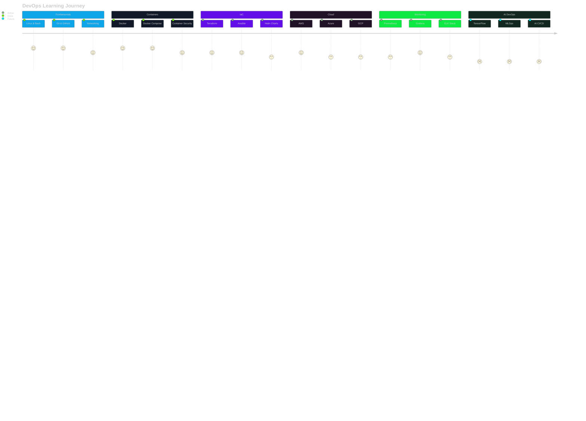

```mermaid
%%{init: {'theme': 'dark', 'themeVariables': { 'primaryColor': '#0ea5e9', 'primaryTextColor': '#ffffff', 'primaryBorderColor': '#22d3ee', 'lineColor': '#3b82f6', 'secondaryColor': '#111827', 'tertiaryColor': '#0d1117', 'fontFamily': 'Fira Code', 'fontSize': '14px'}}}%%
graph LR
    A[📁 Code] -->|Push| B[🐙 GitHub]
    B -->|Trigger| C[⚙️ Jenkins/GA]
    C -->|Build| D[🐳 Docker]
    D -->|Deploy| E[☸️ Kubernetes]
    E -->|Provision| F[🏗️ Terraform]
    F -->|Configure| G[🔧 Ansible]
    G -->|Monitor| H[📊 Grafana]
    H -->|Alert| A

    style A fill:#0d1117,stroke:#22d3ee,stroke-width:2px,color:#fff
    style B fill:#0d1117,stroke:#f97316,stroke-width:2px,color:#fff
    style C fill:#0d1117,stroke:#D24939,stroke-width:2px,color:#fff
    style D fill:#0d1117,stroke:#2496ED,stroke-width:2px,color:#fff
    style E fill:#0d1117,stroke:#326CE5,stroke-width:2px,color:#fff
    style F fill:#0d1117,stroke:#7B42BC,stroke-width:2px,color:#fff
    style G fill:#0d1117,stroke:#EE0000,stroke-width:2px,color:#fff
    style H fill:#0d1117,stroke:#F46800,stroke-width:2px,color:#fff
```

<div align="center">


<a href="https://git.io/typing-svg">
  
</a>

<br/>

<a href="https://github.com/DevPawanX">
  
</a>
<a href="https://github.com/SakshuOfficialOS">
  
</a>
<a href="https://discord.com/users/dev.pawanx_">
  
</a>
<a href="mailto:proxypawang@gmail.com">
  
</a>

<br/><br/>


</div>


<br/>

##  &nbsp; About Me

<div align="center">

```yml
╔══════════════════════════════════════════════════════════════════════╗
║                                                                      ║
║   $ whoami                                                           ║
║   ──────────────────────────────────────────────────────────────     ║
║                                                                      ║
║   Name          :  DevPawanX                                         ║
║   Organization  :  SakshuOfficialOS                                  ║
║   Role          :  DevOps Engineer                                   ║
║   Age           :  26                                                ║
║   Languages     :  English, Hinglish                                 ║
║   Focus         :  Cloud Infrastructure · CI/CD · Automation · IaC   ║
║   Email         :  proxypawang@gmail.com                             ║
║   Discord       :  dev.pawanx_                                       ║
║                                                                      ║
║   $ cat philosophy.txt                                               ║
║   > "Automate everything. Document everything.                       ║
║      Break nothing in production."                                   ║
║                                                                      ║
╚══════════════════════════════════════════════════════════════════════╝
```

</div>

<br/>

<div align="center">

Professional DevOps Engineer focused on building scalable infrastructure, automating delivery pipelines, and improving system reliability across cloud-native environments.  
Intermediate proficiency in **Python, Node.js, and HTML** — combined with **advanced hands-on experience** in DevOps tooling, CI/CD workflows, container orchestration, infrastructure automation, monitoring, and cloud operations.

<br/>

> *"Automate everything. Document everything. Break nothing in production."*

<br/>


</div>

<br/>


<br/>

</div>

<br/>

<div align="center">

<!-- GitHub Profile Summary Cards -->


<br/>


</div>

##  &nbsp; Tech Stack

<div align="center">

###  &nbsp; DevOps & Infrastructure
<p>
  
</p>

###  &nbsp; Programming
<p>
  
</p>

###  &nbsp; Tools & Platforms
<p>
  
</p>

</div>


##  &nbsp; Advanced DevOps Toolchain

<div align="center">

<p>
  
</p>

<br/>

<p>
  
  
  
  
  
  
  
  
</p>

<br/>

|  &nbsp; Area | Tools |
|:------|:-------|
|  &nbsp; CI/CD Automation | Jenkins · GitHub Actions · ArgoCD |
|  &nbsp; Containers & Orchestration | Docker · Kubernetes · Helm |
|  &nbsp; Infrastructure as Code | Terraform · Ansible |
|  &nbsp; Cloud Platforms | AWS · Azure · Google Cloud |
|  &nbsp; Monitoring & Logs | Prometheus · Grafana · ELK Stack |
|  &nbsp; AI in DevOps | TensorFlow · AI-assisted CI/CD |

</div>


##  &nbsp; DevOps Skill Proficiency

<div align="center">

|  Skill | Proficiency | Level |
|:---|:---|:---:|
|  &nbsp; CI/CD Automation |  | **95%** |
|  &nbsp; Container Orchestration |  | **92%** |
|  &nbsp; Infrastructure as Code |  | **88%** |
|  &nbsp; Cloud Platforms (AWS) |  | **85%** |
|  &nbsp; Monitoring & Logging |  | **82%** |
|  &nbsp; Containerization |  | **90%** |
|  &nbsp; Python Scripting |  | **68%** |
|  &nbsp; Node.js Development |  | **58%** |
|  &nbsp; AI/ML in DevOps |  | **52%** |

</div>


##  &nbsp; Current DevOps Workflow

<div align="center">

<a href="https://git.io/typing-svg">
  
</a>

<br/><br/>



<br/>

<table>
  <tr>
    <td align="center">
      
      <br/><b>GITHUB</b>
    </td>
    <td align="center">
      
    </td>
    <td align="center">
      
      <br/><b>JENKINS</b>
    </td>
    <td align="center">
      
    </td>
    <td align="center">
      
      <br/><b>DOCKER</b>
    </td>
    <td align="center">
      
    </td>
    <td align="center">
      
      <br/><b>KUBERNETES</b>
    </td>
  </tr>
  <tr>
    <td align="center">
      
      <br/><b>TERRAFORM</b>
    </td>
    <td align="center">
      
    </td>
    <td align="center">
      
      <br/><b>ANSIBLE</b>
    </td>
    <td align="center">
      
    </td>
    <td align="center">
      
      <br/><b>GRAFANA</b>
    </td>
    <td align="center">
      
    </td>
    <td align="center">
      
      <br/><b>PROMETHEUS</b>
    </td>
  </tr>
</table>

<br/>

<table>
  <tr>
    <td align="center">
      <br/>
      <sub><b>Code</b></sub>
    </td>
    <td align="center"><b>&nbsp;➜&nbsp;</b></td>
    <td align="center">
      <br/>
      <sub><b>Build</b></sub>
    </td>
    <td align="center"><b>&nbsp;➜&nbsp;</b></td>
    <td align="center">
      <br/>
      <sub><b>Container</b></sub>
    </td>
    <td align="center"><b>&nbsp;➜&nbsp;</b></td>
    <td align="center">
      <br/>
      <sub><b>Deploy</b></sub>
    </td>
    <td align="center"><b>&nbsp;➜&nbsp;</b></td>
    <td align="center">
      <br/>
      <sub><b>Provision</b></sub>
    </td>
    <td align="center"><b>&nbsp;➜&nbsp;</b></td>
    <td align="center">
      <br/>
      <sub><b>Configure</b></sub>
    </td>
    <td align="center"><b>&nbsp;➜&nbsp;</b></td>
    <td align="center">
      <br/>
      <sub><b>Observe</b></sub>
    </td>
    <td align="center"><b>&nbsp;➜&nbsp;</b></td>
    <td align="center">
      <br/>
      <sub><b>Alert</b></sub>
    </td>
  </tr>
</table>

</div>


##  &nbsp; DevOps Certification Roadmap

<div align="center">

<a href="https://git.io/typing-svg">
  
</a>

<br/><br/>



<br/>

<table>
  <tr>
    <td align="center" width="33%">
      <br/><br/>
      <br/><br/>
      <sub><b>Linux · Git · Bash · Networking</b></sub><br/><br/>
      
    </td>
    <td align="center" width="33%">
      <br/><br/>
      <br/><br/>
      <sub><b>Docker · Compose · Security</b></sub><br/><br/>
      
    </td>
    <td align="center" width="33%">
      <br/><br/>
      <br/><br/>
      <sub><b>Terraform · Ansible · Helm</b></sub><br/><br/>
      
    </td>
  </tr>
  <tr>
    <td align="center" width="33%">
      <br/><br/>
      <br/><br/>
      <sub><b>AWS · Azure · GCP</b></sub><br/><br/>
      
    </td>
    <td align="center" width="33%">
      <br/><br/>
      <br/><br/>
      <sub><b>Prometheus · Grafana · ELK</b></sub><br/><br/>
      
    </td>
    <td align="center" width="33%">
      <br/><br/>
      <br/><br/>
      <sub><b>TensorFlow · AI CI/CD · MLOps</b></sub><br/><br/>
      
    </td>
  </tr>
</table>

<br/>


</div>


##  &nbsp; GitHub Stats & Activity

<div align="center">

<!-- Trophies -->


<br/><br/>

<!-- Stats Cards -->


<br/>

<!-- Streak -->


<br/>

<!-- Activity Graph -->


</div>

##  &nbsp; DevOps Focus Areas

<div align="center">

<a href="https://git.io/typing-svg">
  
</a>

<br/><br/>


</div>

<!-- Snake Contribution Animation -->
<picture>
  <source media="(prefers-color-scheme: dark)" srcset="https://raw.githubusercontent.com/platane/snk/output/github-contribution-grid-snake-dark.svg" />
  <source media="(prefers-color-scheme: light)" srcset="https://raw.githubusercontent.com/platane/snk/output/github-contribution-grid-snake.svg" />
  
</picture>

</div>

<!-- Animated Divider -->


<br/>

##  &nbsp; Featured Projects

<div align="center">

<table>
  <tr>
    <td width="50%">
      <h3 align="center"> &nbsp; CI/CD Pipeline Automation</h3>
      <p align="center">
        Automated build, test, and deployment workflows for faster and more reliable software delivery.
      </p>
      <p align="center">
        
        
        
      </p>
    </td>
    <td width="50%">
      <h3 align="center"> &nbsp; Kubernetes Deployment System</h3>
      <p align="center">
        Production-ready container deployment workflow with orchestration, scaling, and rollout management.
      </p>
      <p align="center">
        
        
        
      </p>
    </td>
  </tr>
  <tr>
    <td width="50%">
      <h3 align="center"> &nbsp; Infrastructure as Code Templates</h3>
      <p align="center">
        Reusable and modular infrastructure templates for provisioning secure, scalable environments.
      </p>
      <p align="center">
        
        
        
      </p>
    </td>
    <td width="50%">
      <h3 align="center"> &nbsp; Monitoring Stack Setup</h3>
      <p align="center">
        End-to-end observability stack for metrics, dashboards, alerting, and centralized log analysis.
      </p>
      <p align="center">
        
        
        
      </p>
    </td>
  </tr>
  <tr>
    <td width="50%">
      <h3 align="center"> &nbsp; Docker Security Scanner</h3>
      <p align="center">
        Automated container vulnerability scanning with Trivy and SonarQube integrated into CI pipelines.
      </p>
      <p align="center">
        
        
        
      </p>
    </td>
    <td width="50%">
      <h3 align="center"> &nbsp; Cloud Cost Optimizer</h3>
      <p align="center">
        Automated cloud resource management and cost optimization scripts for multi-cloud environments.
      </p>
      <p align="center">
        
        
        
      </p>
    </td>
  </tr>
</table>

</div>


##  &nbsp; Quick Metrics

<div align="center">

<table>
  <tr>
    <td align="center">
      <br/><br/>
      
    </td>
    <td align="center">
      <br/><br/>
      
    </td>
    <td align="center">
      <br/><br/>
      
    </td>
    <td align="center">
      <br/><br/>
      
    </td>
    <td align="center">
      <br/><br/>
      
    </td>
    <td align="center">
      <br/><br/>
      
    </td>
  </tr>
</table>

</div>


##  &nbsp; Contact

<div align="center">

<a href="https://git.io/typing-svg">
  
</a>

<br/><br/>

<a href="https://github.com/DevPawanX">
  
</a>
<a href="https://discord.com/users/dev.pawanx_">
  
</a>
<a href="mailto:proxypawang@gmail.com">
  
</a>

</div>

---

##  Extra Widgets

<div align="center">


</div>

<!-- Snake Contribution Animation -->
<picture>
  <source media="(prefers-color-scheme: dark)" srcset="https://raw.githubusercontent.com/platane/snk/output/github-contribution-grid-snake-dark.svg" />
  <source media="(prefers-color-scheme: light)" srcset="https://raw.githubusercontent.com/platane/snk/output/github-contribution-grid-snake.svg" />
  
</picture>

</div>

<!-- Animated Divider -->


<br/>


## Credits

<div align="center">

**Designed and maintained by DevPawanX**  
**All configurations, infrastructure designs, and automation workflows created and documented by DevPawanX.**

**README crafted by:** [Sakshu1347](https://github.com/Sakshu1347) · **Template & design credits:** [SakshuOfficialOS](https://github.com/SakshuOfficialOS)

<br/>


</div>

<br/>

<div align="center">

<a href="https://git.io/typing-svg">
  
</a>

</div>

<br/>

<div align="center">
  
</div>
